# SmsCode

[English](./README.md)

SmsCode 是一个基于 Vue 3 的短信验证码与号码业务前端系统，面向号码租赁、验证码接收、套餐订阅、订单管理、余额管理和 OpenAPI 对接等业务场景。

## 项目概览

本项目提供完整的前台展示页与登录后的业务控制台，主要包含：

- 账号登录、注册、找回密码与验证码校验
- 号码租赁：收发号码、释放号码、加黑号码
- 套餐订阅：套餐订单、订阅套餐、订阅号码管理
- 订单管理：我的订单、订单下载、消费统计
- 账户中心：余额中心、个人资料、外观设置、OpenAPI 配置
- API 文档：公开 API 文档页面，便于外部系统对接
- 多语言、深色模式、响应式布局与侧边栏导航

## 技术栈

- **框架**：Vue 3 + Composition API
- **构建工具**：Vite 6
- **语言**：TypeScript
- **路由**：Vue Router 4
- **状态管理**：Pinia
- **请求库**：Axios
- **UI 组件**：shadcn-vue、Radix Vue
- **样式**：Tailwind CSS
- **表格**：TanStack Vue Table
- **国际化**：Vue I18n
- **图标**：Lucide Vue Next、Iconify
- **工具库**：VueUse、Zod、Vee-Validate

## 快速开始

### 环境要求

建议使用：

- Node.js 18+
- pnpm 9+

### 安装依赖

```bash
pnpm install
```

### 启动开发环境

```bash
pnpm run dev
```

### 生产构建

```bash
pnpm run build
```

### 本地预览构建产物

```bash
pnpm run preview
```

## 可用脚本

- `pnpm run dev`：启动 Vite 开发服务器
- `pnpm run build`：执行 TypeScript 检查并构建生产包
- `pnpm run preview`：本地预览生产构建结果

## 核心功能

### 认证与登录

- 账号密码登录
- 注册账号
- 找回密码
- 图形验证码校验
- 登录成功后获取用户信息
- 支持 URL Token 直登：`?act=admin_login&token=xxx&refreshToken=xxx#/`
- 支持记住密码

### 号码租赁

- 按项目、国家、消息类型筛选号码
- 获取号码并轮询验证码
- 展示号码、国家区号、端口、PKEY 等信息
- 支持释放号码与加入黑名单
- 支持国家价格、用户价格与渠道价格展示

### 套餐订阅

- 查看套餐订单
- 订阅套餐
- 管理订阅号码
- 支持套餐订单状态与时间信息展示

### 订单管理

- 我的订单列表
- 支持国家、项目、状态、手机号、订单号、时间范围筛选
- 展示订单号、国家、项目、手机号、ICCID/IMSI、价格、状态、验证码、短信内容、来源与时间信息
- 订单导出与下载任务
- 消费统计

### 账户与设置

- 个人资料
- 外观设置
- 余额中心
- 顶部栏展示当前余额并可跳转充值中心
- OpenAPI 配置
- API 文档入口

### 国际化与主题

- 支持多语言切换
- 支持深色/浅色模式
- 响应式侧边栏布局

## 主要路由

### 公开页面

- `/`：首页
- `/api`：API 文档
- `/blog`：博客
- `/help`：帮助中心
- `/about`：关于我们
- `/sign-in`：登录
- `/sign-up`：注册
- `/reset-password`：重置密码

### 控制台页面

- `/app/dashboard`：控制台
- `/app/number-rental/receive-number`：收发号码
- `/app/number-rental/release-number`：释放号码
- `/app/number-rental/blacklist-number`：加黑号码
- `/app/package-subscription/package-orders`：套餐订单
- `/app/package-subscription/subscribe-plan`：订阅套餐
- `/app/package-subscription/number-management`：号码管理
- `/app/order-management/my-orders`：我的订单
- `/app/order-management/order-download`：订单下载
- `/app/order-management/expense-statistics`：消费统计
- `/app/settings/profile`：个人资料
- `/app/settings/appearance`：外观设置
- `/app/settings/balance`：余额中心
- `/app/settings/openapi`：OpenAPI 配置

## 项目结构

```text
src/
├── api/                 # 接口请求封装
├── components/          # 通用组件
│   └── ui/              # UI 基础组件
├── composables/         # 组合式函数
├── layouts/             # 页面布局
├── lib/                 # 工具函数、状态码、HTTP 封装
├── locales/             # 多语言文案
├── plugins/             # 插件配置
├── router/              # 路由配置
├── store/               # Pinia 状态管理
├── typings/             # TypeScript 类型声明
├── views/               # 页面组件
├── App.vue              # 根组件
└── main.ts              # 应用入口
```

## 开发说明

- 路由模式使用 `createWebHashHistory()`。
- 登录状态通过 Pinia 和 `localStorage` 维护。
- 用户信息会在应用启动时自动恢复或刷新。
- 系统配置通过公共配置 Store 初始化后再渲染页面。
- 页面缓存通过 `keep-alive` 和路由名称控制。

## 截图

### 前台页面

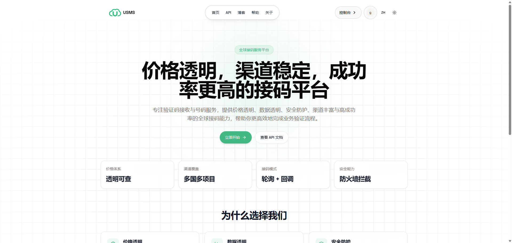
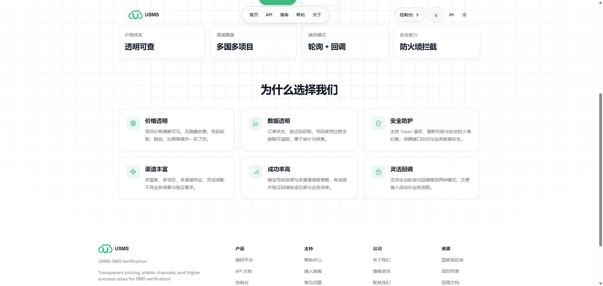
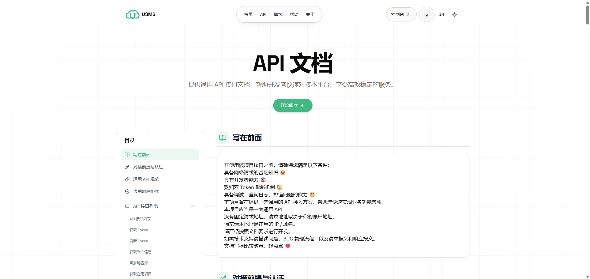
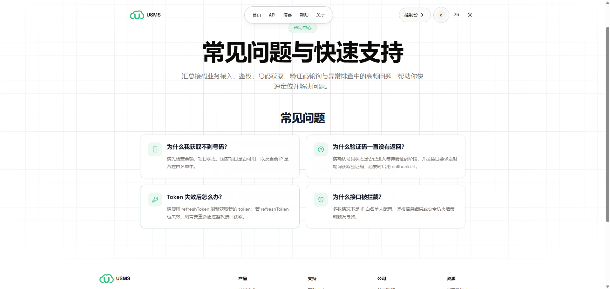
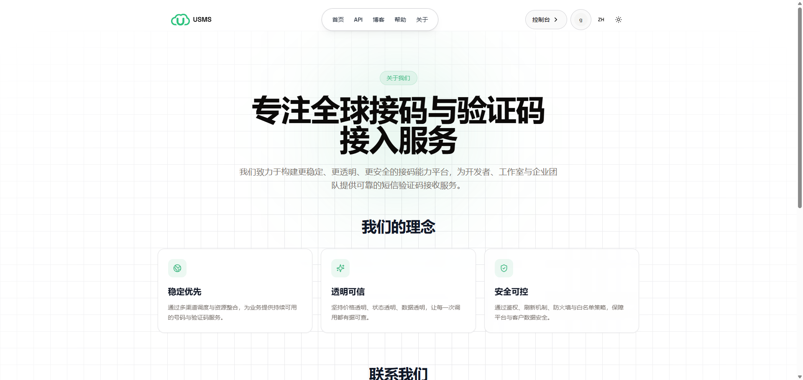
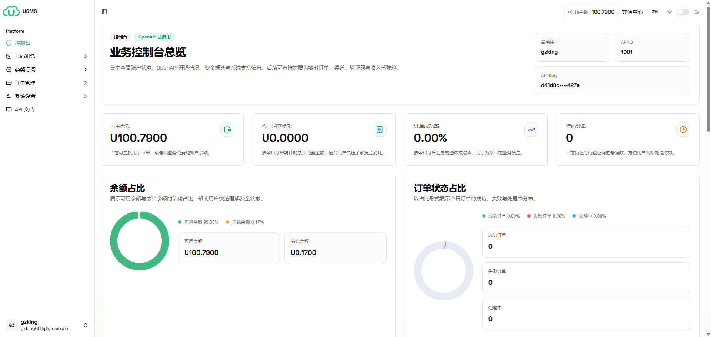
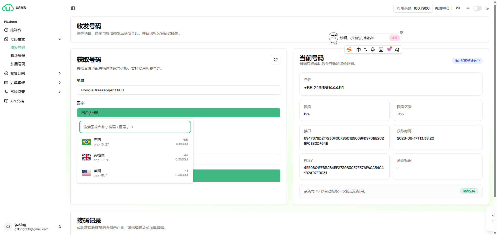
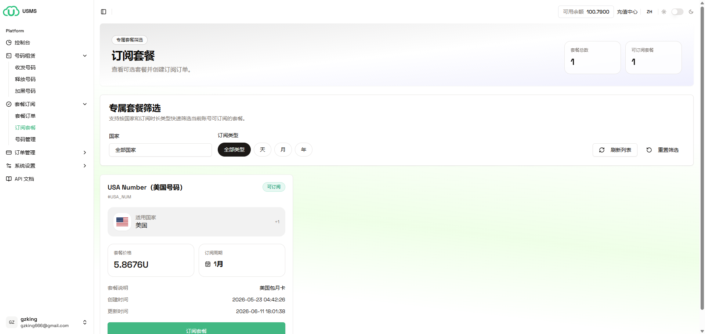
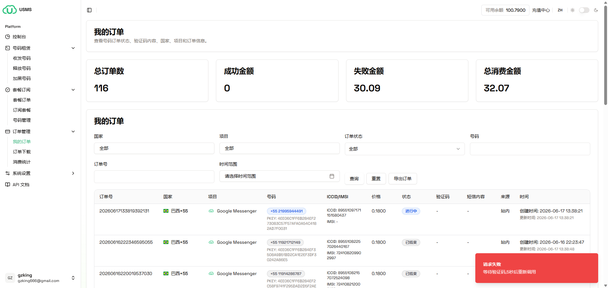
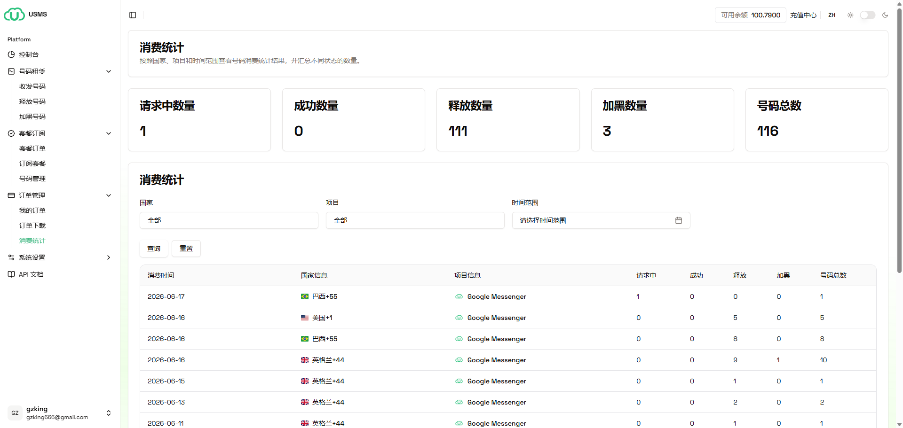
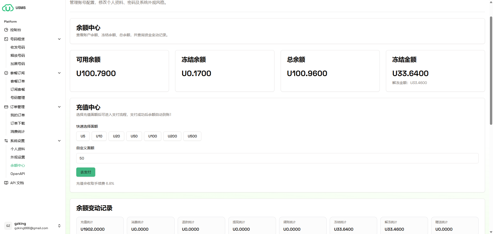
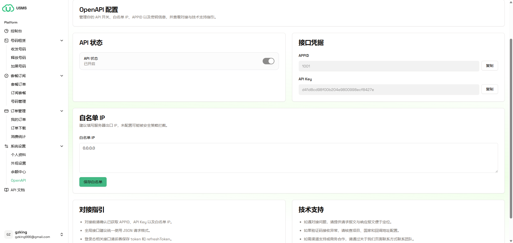

### 后台控制台

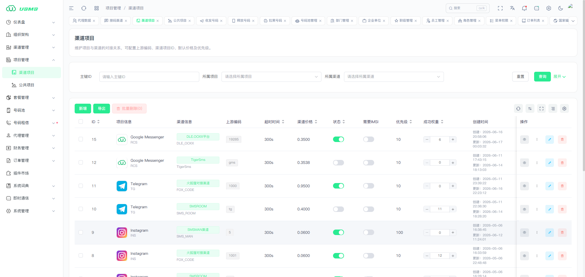
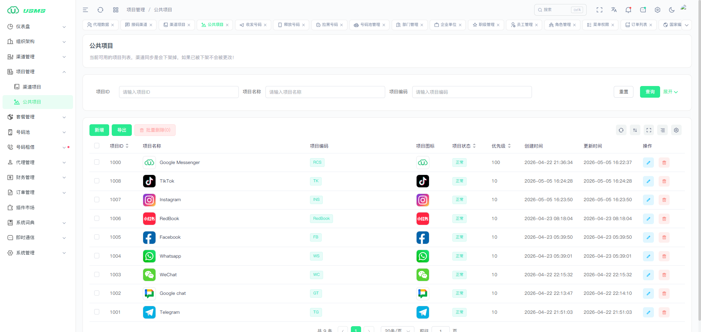
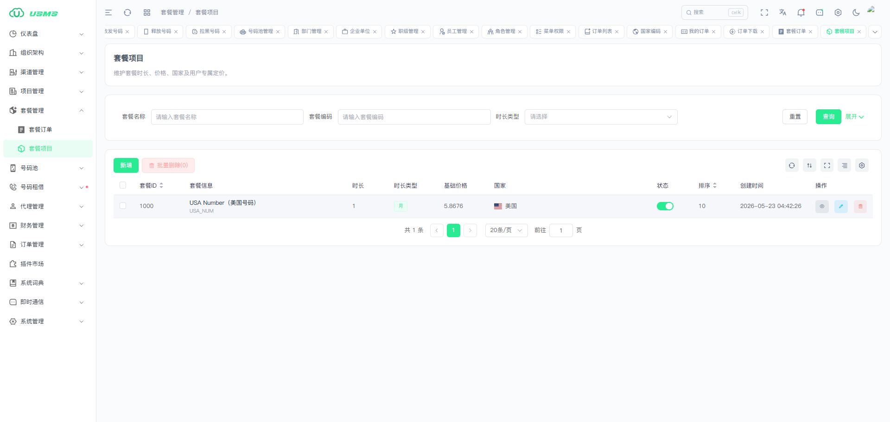
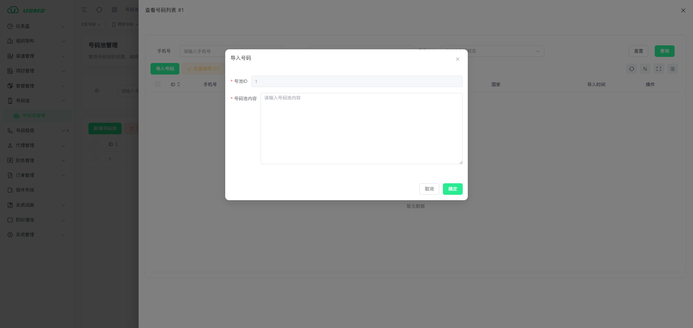
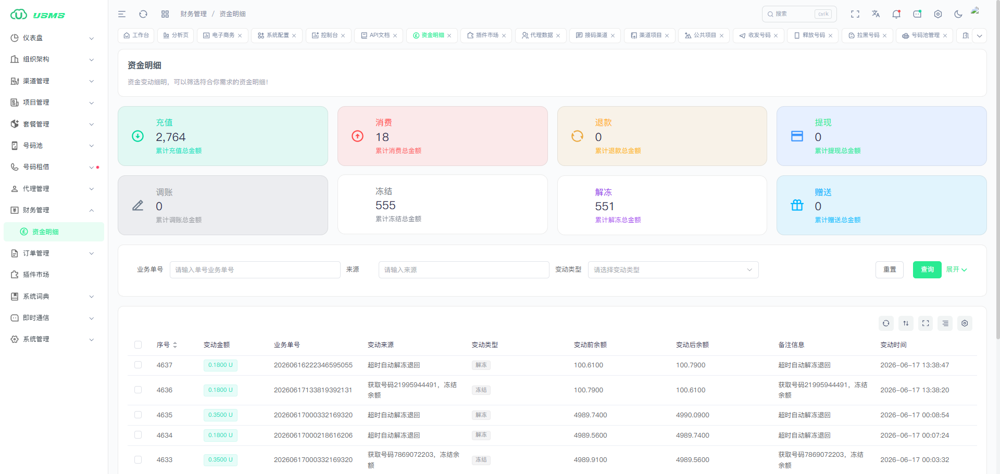
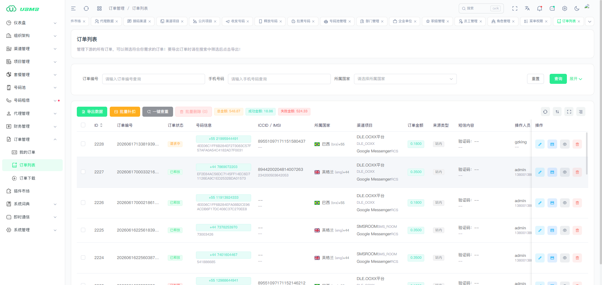

## License

Private Project.
