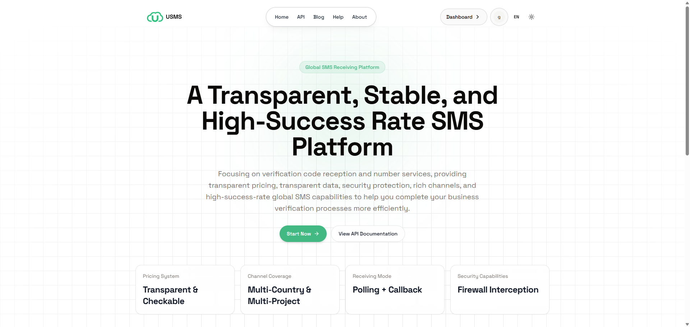

# SmsCode - 一款自有业务的短信验证码与号码接码平台

[English](./README.md)

SmsCode 是一个基于 Vue 3 的短信验证码和号码服务前端应用，面向号码租赁、短信验证码接收、套餐订阅、订单管理、余额管理和 OpenAPI 集成等业务场景。

完整产品由后端服务、后台管理前端和此前台用户端组成。后端负责处理业务逻辑，后台管理前端负责平台运营管理，此前台前端负责提供用户门户和业务控制台。



## 说明

- 本仓库仅开源用户端前台代码，不包含后端和后台管理前端代码。如需完整源代码，请联系 t.me/@AnyGzking。
- 基于 Vue 3 + Composition API 和 Vite 6 构建。
- 使用 TypeScript 编写，提供更好的类型安全。
- 使用 Tailwind CSS 进行样式开发，支持响应式布局和深色模式。
- UI 层使用 Radix Vue 和 shadcn-vue 风格组件。
- 使用 Vue Router 4 进行单页应用路由管理和导航守卫控制。

## 项目概览

本项目提供公开页面和登录后的业务控制台，主要包含：

- 账号登录、注册、找回密码与图形验证码校验
- 号码租赁：接收号码、释放号码和加黑号码
- 套餐订阅：套餐订单、订阅套餐和订阅号码管理
- 订单管理：我的订单、订单下载和消费统计
- 账户中心：余额中心、个人资料、外观设置和 OpenAPI 配置
- API 文档页面，便于外部系统集成对接
- 多语言支持、深色模式、响应式布局和侧边栏导航

## 技术栈

- **框架**：Vue 3 + Composition API
- **构建工具**：Vite 6
- **语言**：TypeScript
- **路由**：Vue Router 4
- **状态管理**：Pinia
- **HTTP 客户端**：Axios
- **UI 组件**：shadcn-vue、Radix Vue
- **样式**：Tailwind CSS
- **表格**：TanStack Vue Table
- **国际化**：Vue I18n
- **图标**：Lucide Vue Next、Iconify
- **工具库**：VueUse、Zod、Vee-Validate

## 快速开始

### 环境要求

推荐环境：

- Node.js 18+
- pnpm 9+

### 安装依赖

```bash
pnpm install
```

### 启动开发服务器

```bash
pnpm run dev
```

### 生产构建

```bash
pnpm run build
```

### 预览生产构建

```bash
pnpm run preview
```

## 可用脚本

- `pnpm run dev`：启动 Vite 开发服务器
- `pnpm run build`：运行 TypeScript 检查并创建生产构建
- `pnpm run preview`：在本地预览生产构建结果

## 核心功能

### 认证

- 账号密码登录
- 账号注册
- 找回密码
- 图形验证码校验
- 登录成功后获取用户信息
- URL Token 登录：`?act=admin_login&token=xxx&refreshToken=xxx#/`
- 记住密码选项

### 号码租赁

- 按项目、国家和消息类型筛选号码
- 获取号码并轮询短信验证码
- 展示手机号、国家区号、端口、PKEY 和相关元数据
- 释放号码并将号码加入黑名单
- 展示国家价格、用户价格和渠道价格

### 套餐订阅

- 查看套餐订单
- 订阅套餐
- 管理订阅号码
- 展示套餐订单状态和时间信息

### 订单管理

- 我的订单列表
- 按国家、项目、状态、手机号、订单号和时间范围筛选
- 展示订单号、国家、项目、手机号、ICCID/IMSI、价格、状态、验证码、短信内容、来源和时间信息
- 导出订单并管理下载任务
- 消费统计

### 账户与设置

- 个人资料页面
- 外观设置
- 余额中心
- 顶部余额展示和快捷充值入口
- OpenAPI 配置
- API 文档入口

### 国际化与主题

- 多语言切换
- 浅色和深色模式
- 响应式侧边栏布局

## 路由

### 公开路由

- `/`：首页
- `/api`：API 文档
- `/blog`：博客
- `/help`：帮助中心
- `/about`：关于我们
- `/sign-in`：登录
- `/sign-up`：注册
- `/reset-password`：重置密码

### 控制台路由

- `/app/dashboard`：控制台
- `/app/number-rental/receive-number`：接收号码
- `/app/number-rental/release-number`：释放号码
- `/app/number-rental/blacklist-number`：加黑号码
- `/app/package-subscription/package-orders`：套餐订单
- `/app/package-subscription/subscribe-plan`：订阅套餐
- `/app/package-subscription/number-management`：号码管理
- `/app/order-management/my-orders`：我的订单
- `/app/order-management/order-download`：订单下载
- `/app/order-management/expense-statistics`：消费统计
- `/app/settings/profile`：个人资料
- `/app/settings/appearance`：外观设置
- `/app/settings/balance`：余额中心
- `/app/settings/openapi`：OpenAPI 配置

## 项目结构

```text
src/
├── api/                 # API 请求封装
├── components/          # 可复用组件
│   └── ui/              # 基础 UI 组件
├── composables/         # Vue 组合式函数
├── layouts/             # 布局组件
├── lib/                 # 工具函数、状态码、HTTP 封装
├── locales/             # 国际化文案
├── plugins/             # 插件配置
├── router/              # 路由配置
├── store/               # Pinia 状态管理
├── typings/             # TypeScript 声明
├── views/               # 页面组件
├── App.vue              # 根组件
└── main.ts              # 应用入口
```

## 开发说明

- 路由使用 `createWebHashHistory()`。
- 认证状态通过 Pinia 和 `localStorage` 管理。
- 应用启动时会恢复或刷新用户信息。
- 页面渲染前会先初始化公共系统配置。
- 页面缓存由 `keep-alive` 和路由组件名称控制。

## 截图

### 公开页面


### 用户控制台


## License

Private Project.
